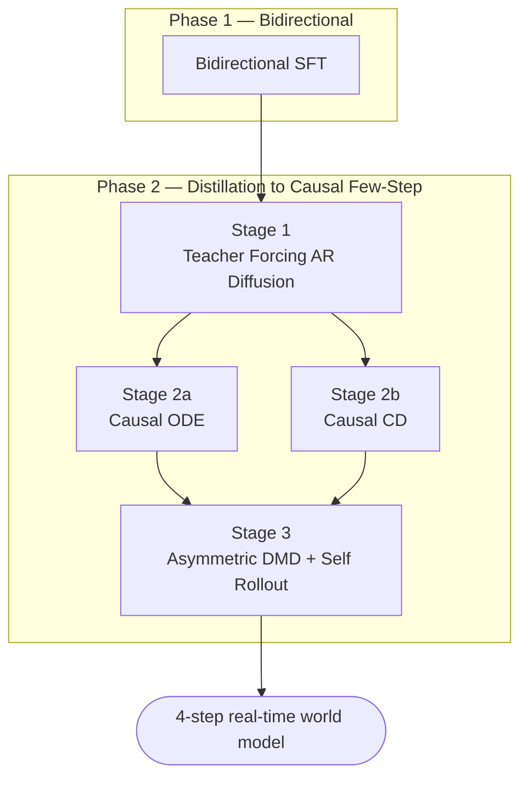

# Architecture

minWM is a detectron2-style training framework: a stage-agnostic engine drives a
swappable per-stage **recipe**, so the same trainer, loss, and dataset
abstractions serve every backbone and every distillation stage.

## Layers

The `minwm/` package is layered so that model code, recipes, and
infrastructure stay decoupled:

| Layer | Package | Responsibility |
|-------|---------|----------------|
| Config | `minwm.config` | Declarative, importable config; classes referenced by `"module.path:ClassName"`. |
| Engine | `minwm.engine` | Everything that *runs* a stage: lifecycle, recipes, generation, optimizers, checkpoint I/O (see below). |
| Sampling | `minwm.sampling` | Model-agnostic generative primitives shared by training/inference: flow-matching schedulers + autoregressive rollout loops. |
| Processors | `minwm.processors` | Config-buildable input/batch preprocessors in one flat package: batch data-prep (device placement, flow noise, clean-context aug, ODE sampling) + inference input prep (latent init, camera trajectory, conditioning). |
| Modeling | `minwm.modeling` | Backbone DiTs, family-private `layers/`, adapters, and shared `common/` code. |
| Data | `minwm.data` | Dataset classes + DP/SP-aware dataloader factories. |
| Distributed | `minwm.distributed` | FSDP2 auto-sharding + sequence-parallel plumbing. |
| Utils | `minwm.utils` | Logging, distributed comm, misc. |

`minwm.engine` is the execution layer, so the pieces that only matter while a
stage is running live inside it rather than as top-level siblings:

| Subpackage | Responsibility |
|------------|----------------|
| `minwm.engine` (top) | `BaseTrainer` / `BaseInferencer` lifecycle + the `Recipe` contract. |
| `minwm.engine.training` | Recipe implementations and training losses. |
| `minwm.engine.inference` | The generation workflow, pipelines, and samplers. |
| `minwm.engine.checkpoint` | Storage backends + Checkpointer (DCP / single-file save & load). |
| `minwm.engine.optim` | Optimizers (Muon), EMA, and optimizer builders. |

`import minwm.engine` stays cheap: `BaseInferencer` is exposed through a PEP 562
`__getattr__`, so training users never load the generation stack.

## Training pipeline

The defining workflow is the distillation of a bidirectional T2V foundation
model into a 4-step autoregressive world model. Each stage emits a checkpoint
that seeds the next:

Both the Wan 2.1 and HunyuanVideo 1.5 lines run this same four-stage pipeline;
adding a third backbone is structurally a wrapper-and-config exercise.

## Diagrams in these docs

This site renders [Mermaid](https://mermaid.js.org/) natively (the diagram
above is a live `mermaid` code fence — view source on this page). Conventions:

- **Mermaid is the default.** Use it for flowcharts, data-processing pipelines,
  and high-level module/dependency graphs. It is plain text, so it diffs cleanly
  in PRs and renders both here and directly on GitHub.
- **Committed SVG is the fallback.** For dense model figures Mermaid can't lay
  out cleanly (attention internals, tensor-shape diagrams, multi-stream blocks),
  draw in Excalidraw or draw.io, export to **SVG**, and commit the **source
  (`.excalidraw` / `.drawio`) alongside the `.svg`** into `docs/assets/` so the
  figure stays editable and reviewable.
- **No PlantUML** (needs a Java server, not GitHub-native) and **no bare PNGs**
  (not diffable, rot over time).
